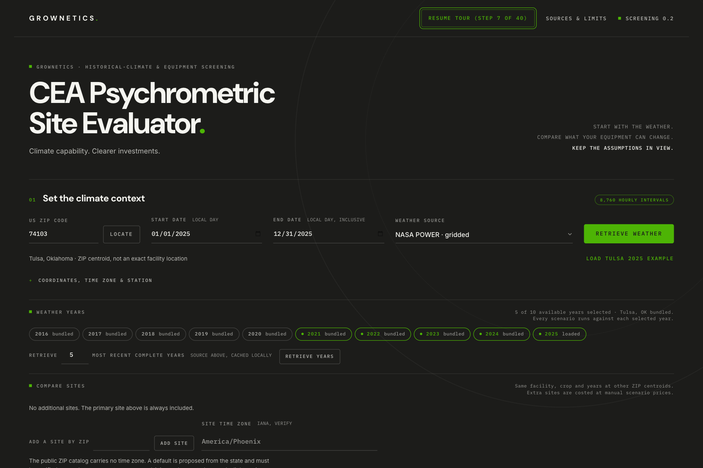
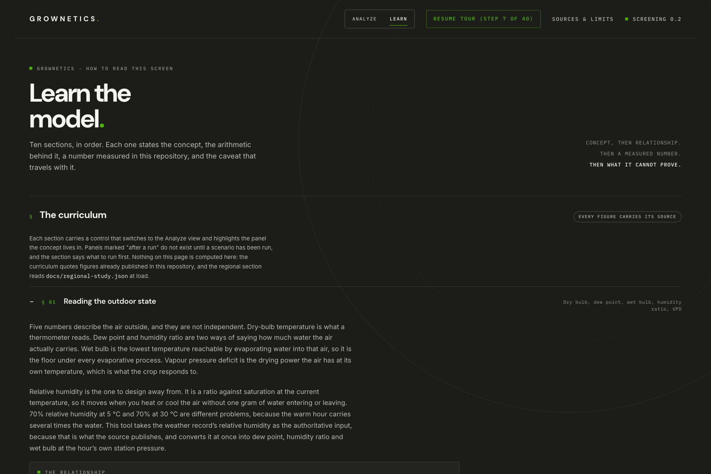

# CEA Psychrometric Site Evaluator

Screen a controlled-environment agriculture site against real historical weather: how many hours the climate gives you for free, what constraint binds, and which class of equipment closes the gap at what running cost.

[](https://github.com/vhark/cea-psychrometric-site-evaluator/actions/workflows/test.yml)
[](#testing)
[](docs/VERIFICATION.md)
[](#quick-start)
[](LICENSE)
[](https://vhark.github.io/cea-psychrometric-site-evaluator/)



A Grownetics tool. Static HTML and JavaScript, no build step, no backend, no account. Everything computes in your browser.

> **Evidence tier: assumption-based screening.** This is a coarse planning screen. It is not a calibrated greenhouse digital twin, not equipment sizing, not a manufacturer comparison, and not a guarantee of indoor conditions. See [Evidence tiers](#evidence-tiers) and [docs/DIGITAL-TWIN.md](docs/DIGITAL-TWIN.md).

## What it answers

Three questions about a specific site, crop band and equipment class, before capital is committed:

1. **What does the climate give for free?** Hours the outside air alone can cool, dry or humidify the zone, with the pad-effective and free-cooling windows counted separately.
2. **What is the binding constraint?** Temperature margin or moisture ceiling, hour by hour and month by month, with the sensible and latent split behind it.
3. **What closes the gap, and at what running cost?** Six equipment strategies compared on joint-band attainment, energy, water and operating cost over ten weather years, with a computed ranking-stability verdict.

## Live demo

| Surface | URL |
|---|---|
| Explainer site | https://vhark.github.io/cea-psychrometric-site-evaluator/ |
| The tool itself | https://vhark.github.io/cea-psychrometric-site-evaluator/app/ |

The hosted tool is the same static folder as this repository. Nothing you enter leaves your browser except the public weather requests you trigger yourself (see [SECURITY.md](SECURITY.md)).

## Quick start

Requirements: Python 3 (any static server works) and a current browser with ES modules, Web Workers and IndexedDB. Node 20 or newer is needed only for tests and the reproduction scripts. No package installation.

```sh
git clone https://github.com/vhark/cea-psychrometric-site-evaluator.git
cd cea-psychrometric-site-evaluator
python3 -m http.server 8150 --bind 127.0.0.1
```

Then open **http://127.0.0.1:8150/** and:

1. Click **Load Tulsa 2025 example** to get a genuine 8,760-hour NASA POWER year without a network call.
2. Import [docs/example-scenarios.json](docs/example-scenarios.json) for the six-strategy comparison.
3. Press **Run all scenarios**, then read attainment, misses, loads, runtime and cost.

Do not open `index.html` through `file://`: module fetches and workers require HTTP.

Full workflow, including ZIP selection, live weather retrieval, CSV import and exports, is in [docs/WORKFLOW.md](docs/WORKFLOW.md).

## What is modeled, and what is not

| Modeled | Not modeled |
|---|---|
| Coupled single-zone sensible and moisture balance with finite equipment capacity, analytic linear exchange and physical equilibrium condensation | Spatial gradients, multi-zone or 3-D air movement, canopy-to-air temperature difference |
| Staged deadband controller on a one-minute dispatch step (ideal per-substep optimizer retained as a labeled upper bound) | Real control hardware behaviour, commissioning, sensor placement, failure resilience |
| Stanghellini transpiration from leaf area, absorbed radiation and zone VPD (fixed L/m²/day schedule kept as a fallback) | Crop physiology, growth stages, yield, CO2 feedback on stomata |
| Condensing dehumidification returning latent plus compressor heat; DX with coupled sensible and latent capacity; integrated reheat with recovered and rejected heat | Manufacturer performance maps, part-load curves, cycling, defrost, minimum run times for specific products |
| Generic desiccant with finite removal, regeneration energy, purchased electric and fuel split, explicit sorption heat; hybrid indirect evaporation with a separate wet secondary stream | Any named product (no Blue Frontier or AGronomic IQ map is claimed), desiccant storage scheduling, water quality and bleed |
| Evaporative pad as an approximately isoenthalpic process at a stated saturation effectiveness | Face-velocity-dependent effectiveness, fouling, uneven wetting |
| Historical solar driving optical DLI separately from thermal gain, footprint photons shared over stacked canopy, causal supplemental lighting | Detailed glazing optics, movable screens, incidence-angle models, real natural-vent pressure flow |
| Historical state and sector average electricity prices applied to the resulting dispatch | Utility tariffs, demand charges, riders, time-of-use optimization, hourly marginal emissions |

Constant-property and ideal-modulation assumptions are exported with every result, so a reader can see which of the above applied to a given number.

## Evidence tiers

| Tier | What it takes | Status here |
|---|---|---|
| 1. Weather feasibility | Traceable outside state, vetted psychrometrics, target bands | Met |
| 2. Assumption-based equipment screen | Coupled model, conservation and numerical checks, declared assumptions | **Current tier** |
| 3. Benchmarked simulation | Matched run against an independent model and published measured data | Not met (roadmap M5) |
| 4. Site-calibrated analysis | Held-out facility sensor, energy and condensate data, documented calibration | Not met (roadmap M6) |

The full ladder, with the output each tier permits and the implication each tier prohibits, is in [docs/EVALUATION.md](docs/EVALUATION.md).

## Key results from the bundled example

Everything below is measured output from this repository, not illustration. Sources are linked per row.

| Result | Value | Source |
|---|---|---|
| Controller cadence convergence, Tulsa 2025 full year, 1 min vs 0.5 min | 0.004 / 0.383 / 0.091 pp attainment; 0.31% electricity at most | [VERIFICATION.md](docs/VERIFICATION.md) |
| Ideal optimizer on the same test | Does not converge: 1.5 pp attainment, 1.95% electricity | [VERIFICATION.md](docs/VERIFICATION.md) |
| Bundled Tulsa weather years | Ten years, 2016 to 2025, complete coverage (8,760 or 8,784 h each) | [VERIFICATION.md](docs/VERIFICATION.md) |
| Baseline attainment across five years, six strategies | Median 28.9%, worst year 2025 at 27.1%, spread 2.7 pts | [VERIFICATION.md](docs/VERIFICATION.md) |
| Cost ranking stability across those years | **Not stable**: 2 distinct orders over 5 years | [VERIFICATION.md](docs/VERIFICATION.md) |
| Tulsa vs Phoenix, pad-effective hours | 244 vs 2,334 h | [VERIFICATION.md](docs/VERIFICATION.md) |
| Tulsa vs Phoenix, free-cooling hours | 401 vs 2,636 h | [VERIFICATION.md](docs/VERIFICATION.md) |
| Tulsa pad runtime vs weather-side pad viability | Pad ran 2,772 h on 296 days; the weather screen clears both limits in only 244 h on 65 days | [AUDIT.md](docs/AUDIT.md) |
| Binding limit at Tulsa | Moisture ceiling binds 3,851 h, temperature margin 2,952 h | [AUDIT.md](docs/AUDIT.md) |
| Outside air vs a 2.5 L/kWh dehumidifier | Outside air wins on cost per kg in 4,970 h and on energy per kg in 1,752 h | [AUDIT.md](docs/AUDIT.md) |
| Most influential assumption (Morris mu\*) | Leaf area and transpiration: 9.10 pp attainment, ahead of envelope U (5.89) and shade fraction (3.43) | [SENSITIVITY.md](docs/SENSITIVITY.md) |
| Strategy ranking under the screened ranges | Unstable: 3 orders, most common 61.5%. The three cheapest positions are identical in 104 of 104 points | [SENSITIVITY.md](docs/SENSITIVITY.md) |
| Conservation identities | Close between 1e-16 and 5e-13 relative | [AUDIT.md](docs/AUDIT.md) |

Not claimed: no independent model benchmark, no site calibration, no equipment performance maps.

## Example scenarios

Load a weather record, then **Import JSON / CSV** and pick a set from [docs/examples/](docs/examples/README.md). Each set is a comparison that answers one design question: coupled reheat against decoupled latent removal, an opaque indoor rack farm, a near-saturated mushroom room, a moisture-bound propagation nursery, and a semi-closed hybrid with a tall crop. The canonical six-strategy comparison stays in [docs/example-scenarios.json](docs/example-scenarios.json).

## Learn tab



The interface has two views. **Analyze** is the calculator. **Learn** is a ten-part curriculum that teaches the
psychrometrics behind the screening in the order the tool applies it: reading the outdoor state, what attainment
is a percentage of, what the climate gives free, the sensible/latent split, outside air as a dehumidifier, the
capacity frontier, screens as a schedule, why one year is an anecdote, what actually moves the answer, and a
closing section that reports what ten weather years recommend in each bundled region. Each part carries the
relationship it teaches and a button that switches to Analyze and highlights the panel where you would read it,
so the concept and its evidence are never separated. Modules are linkable: `#learn/uncertainty`,
`#learn/regional-findings`.

The closing section is generated, not written. [docs/regional-study.json](docs/regional-study.json) is produced by
`node scripts/regional-study.mjs` (300 full-year simulations: 5 sites x 10 years x 6 strategies) and
[docs/REGIONS.md](docs/REGIONS.md) states the recommendation rule, including when the evidence does not resolve a
region and what measurement would. Three of the five regions currently return no recommendation, by rule: Phoenix, Denver and Seattle.

## Documentation

| Document | Purpose |
|---|---|
| [docs/README.md](docs/README.md) | Index of every document with reading order |
| [docs/GLOSSARY.md](docs/GLOSSARY.md) | Every domain term the interface uses, with unit and how it is computed here |
| [docs/WORKFLOW.md](docs/WORKFLOW.md) | Step-by-step use of the tool, import formats, exports and their limits |
| [docs/PRD.md](docs/PRD.md) | Product requirements and approved scope, including the v0.2 site-evaluator contract (§10) |
| [docs/ARCHITECTURE.md](docs/ARCHITECTURE.md) | Deployment decision, module boundaries, data contracts, controller design |
| [docs/IMPLEMENTATION.md](docs/IMPLEMENTATION.md) | Cross-module interface contract and file ownership |
| [docs/EVALUATION.md](docs/EVALUATION.md) | Evidence ladder, acceptance gates and the checks each tier requires |
| [docs/VERIFICATION.md](docs/VERIFICATION.md) | Checks actually executed, with measured values and dates |
| [docs/AUDIT.md](docs/AUDIT.md) | Independent review findings, fixes, and the status of every open item |
| [docs/SENSITIVITY.md](docs/SENSITIVITY.md) | Morris screening: which assumptions move the answer, and whether the ranking survives |
| [docs/REGIONS.md](docs/REGIONS.md) | The ten-year regional study: method, recommendation rule, and the verdict for each bundled climate |
| [docs/ENERGY-DATA.md](docs/ENERGY-DATA.md) | ZIP, utility, price and grid catalogs: coverage, vintages and limits |
| [docs/RESEARCH.md](docs/RESEARCH.md) | Landscape review and source register behind the build decision |
| [docs/DIGITAL-TWIN.md](docs/DIGITAL-TWIN.md) | Roadmap M1 to M6 to a calibrated twin, with the claim each milestone earns |
| [CONTRIBUTING.md](CONTRIBUTING.md) | How to run, the no-dependency rule, evidence discipline, test philosophy |
| [SECURITY.md](SECURITY.md) | What leaves the browser, and how to report an issue |
| [CHANGELOG.md](CHANGELOG.md) | Release history |

## Data sources and vintages

| Dataset | Vintage | What it is, and is not |
|---|---|---|
| NASA POWER hourly meteorology and solar | Ten Tulsa years, 2016 to 2025. The 2025 snapshot was retrieved 2026-09-11, the other nine 2026-09-13 | A gridded reconstruction with UTC source timestamps and original payloads retained. RE hourly solar Wh/m² becomes interval-mean W/m² over one hour. Canonical RH is authoritative; inconsistent auxiliary dew and frost points are flagged, never used to overwrite RH. Not station truth. |
| Iowa Environmental Mesonet station observations | Archived study period 2026-01-01 to 2026-09-11 | Routine observations nearest the UTC hour within 30 minutes, original timestamps kept, estimated station pressure flagged. Missing observations never receive NASA meteorology. Solar is independently sourced and can be unavailable. |
| GeoNames ZIP inventory | Retrieved 2026-09-11 | 42,185 records, 39,146 with dated candidate utilities, 27,037 with several candidates, 3,039 with none mapped, 479 mapping-only records without invented coordinates. Not a certified current USPS inventory, and a ZIP does not identify street service. |
| OpenEI utility to ZIP mapping | Mapping year 2021 | Candidate providers only. Not a service-territory determination. |
| EIA state and sector electricity prices | 30,729 monthly observations, generally 2010 through June 2026 (Puerto Rico starts later) | Average price proxies. Not utility tariffs, and no demand charges, riders or time-of-use structure. |
| EPA eGRID generation mix and CO2 | 2023 | Annual subregion generation mix and total-output CO2, preserving multiple ZIP subregions. Other years receive no emissions estimate rather than a silently reused 2023 factor. Regional generation is not utility procurement and not marginal emissions. |
| PsychroLib | 2.5.0, pinned commit | Vendored MIT psychrometric library. |

Original URLs, licences, SHA-256 manifests and coverage counts are in [docs/ENERGY-DATA.md](docs/ENERGY-DATA.md), [docs/RESEARCH.md](docs/RESEARCH.md) and [NOTICE](NOTICE). Where a historical price is missing, the tool reports an unknown total plus a labeled known subtotal; it never falls back to today's price.

## Reproducing the datasets and the screening

```sh
python3 scripts/fetch-weather.py        # NASA POWER snapshots with original payloads
python3 scripts/build-energy.py         # ZIP, utility, price and grid catalogs
node scripts/fetch-observed.mjs         # IEM station observations plus independent solar
node scripts/reference-study.mjs        # the observed weather-only Tulsa study
node scripts/morris-screening.mjs       # Morris elementary-effects screening
```

`build-energy.py` uses openpyxl for the source workbooks: `python3 -m pip install openpyxl` in a virtual environment if it is unavailable. Downloaded source files and SHA-256 manifests are retained, and `--refresh` re-downloads and verifies against them. Source updates can legitimately change data and cutoff dates.

The committed Morris run is 1,872 simulations over 104 design points (8 trajectories, 12 parameters, three years, 120 sampled days each), seed 1, 290 s on 8 threads. Same seed and inputs give byte-identical output apart from `generatedAt` and `runtimeSeconds`. Faster variant:

```sh
node scripts/morris-screening.mjs --years 2016,2025 --trajectories 4 --days 60 --out /tmp/quick.json
```

The observed study in [reference-study/](reference-study/) keeps the weather-only classification separate from the coupled screen: raw and derived hourly CSV, mode, month and day-night summaries, calendar exposures, episodes, percentiles, 16 sensitivity cases, a NOAA daily-extrema cross-check, manifest, Markdown report and HTML charts. Its archived 2026 period contains 6,087 hourly slots, 6,064 observed valid hours and 23 missing, ending 2026-09-11 21:00 UTC exclusive. No complete-year claim is made.

## Testing

```sh
npm test                      # node --test test/*.test.mjs, 63 tests
node --test test/model.test.mjs
```

63 tests pass. They defend physical and data boundaries that a plausible bug would break: no photon creation on stacked canopy, finite control authority, dehumidifier and regeneration energy, cadence-invariant unmet loads, unsaturable-candidate exclusion, pad runtime attribution, missingness, DST and fractional-offset DLI days, bounded import ranges, temporal billing, manual versus historical pricing, six closed-form conservation identities, and Morris design reproducibility.

They are **not empirical greenhouse validation**. A passing suite says the code does what the model says, not that the model matches a real greenhouse.

## Roadmap

| Milestone | Goal | Status |
|---|---|---|
| M0 | v0.2 site-evaluator sprint: multi-year, multi-site, load split, enrichment window, precision sweeps, design-basis brief | Done, 2026-09-13 |
| M1 | Converged staged controller | Done, measured in [VERIFICATION.md](docs/VERIFICATION.md) |
| M2 | State-coupled crop load (Stanghellini transpiration) | Done |
| M3 | Quantified structural sensitivity (Morris) | Done, 2026-09-14, see [SENSITIVITY.md](docs/SENSITIVITY.md) |
| M4 | Equipment maps where they matter | Open |
| M5 | Benchmarked simulation against an independent model (evidence tier 3) | Open |
| M6 | Site-calibrated analysis with held-out validation (evidence tier 4) | Open |

Each milestone states the claim it earns, and nothing beyond it, in [docs/DIGITAL-TWIN.md](docs/DIGITAL-TWIN.md).

## Repository scope

This public repository holds the tool, its public data catalogs and its documentation. Two things are deliberately not here, both listed in `.gitignore`:

- `private/`: material belonging to a client engagement, including an audit of a client's own separate internal calculator. It stays with that engagement.
- `data/energy/raw/`: 36 MB of public-domain government workbooks and CSVs that `scripts/build-energy.py --refresh` re-downloads and verifies against the SHA-256 values already recorded in the committed manifests. The derived catalogs the application actually loads are committed.

Tulsa, Oklahoma is the bundled worked example: ten complete NASA POWER weather years and the ZIP 74103 default give a full run with no network access. Nothing in the tool is specific to that site. Every crop, envelope, equipment and price input is an editable, labeled assumption.

## Contributing

Read [CONTRIBUTING.md](CONTRIBUTING.md) first. Three rules carry most of the weight: no runtime dependencies and no build step, every number carries its basis, and a test earns its place only by defending a real physical or data boundary.

## Licence

Application code is MIT, see [LICENSE](LICENSE). Third-party software and dataset terms, including the vendored PsychroLib 2.5.0 and every public data source, are listed in [NOTICE](NOTICE). Brand names and marks are not licensed as trademarks.
