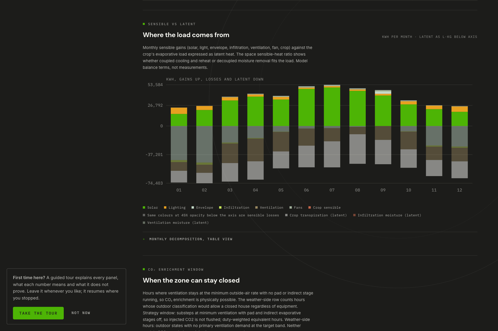
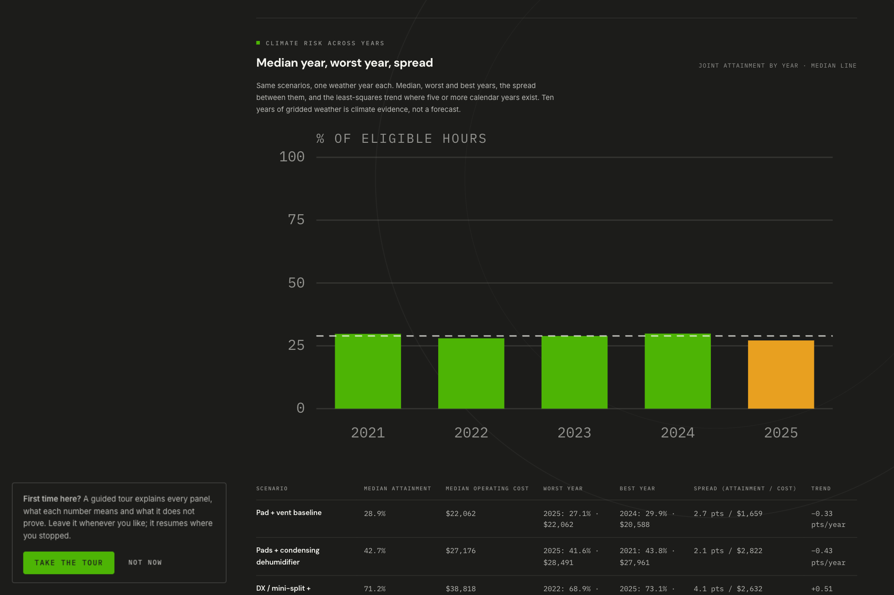
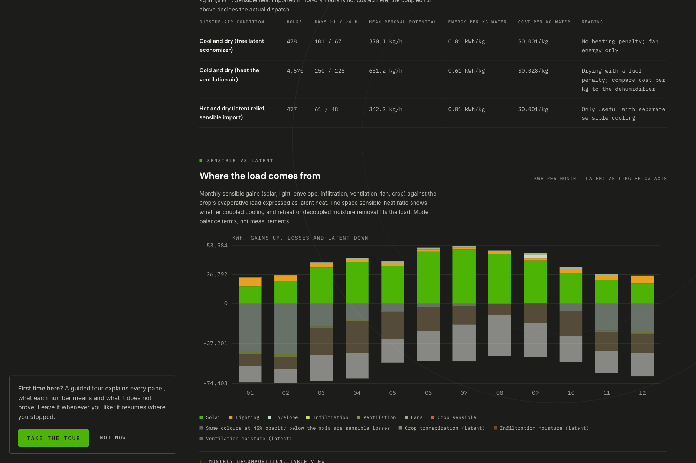
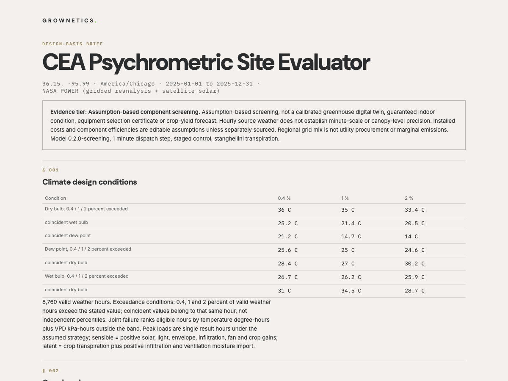

# Using the tool

Purpose: the step-by-step working procedure, from picking a site to exporting a result, including the import formats and what each export does and does not contain.

Status: current for model `0.2.0-screening`, 2026-09-14.

Read this if: you are running the evaluator, or you received an export from someone who did and need to know what it is worth.

## 1. Serve it

```sh
python3 -m http.server 8150 --bind 127.0.0.1
```

Open http://127.0.0.1:8150/. Module fetches and Web Workers do not work over `file://`. To self-host, copy the folder to any static host that serves JavaScript and JSON with correct MIME types, keep paths relative, and serve over HTTPS or localhost. No shared API key is embedded and none is needed.

A lightweight deployment may omit raw datasets and reports, but must retain `data/us-zips.json`, `data/energy/*.json`, `data/weather/`, `src/`, `vendor/`, `styles.css` and `index.html`, with source and licence attribution intact. Google Fonts are optional presentation assets; system fallbacks remain usable.

The interface opens on **Analyze**, the calculator these steps describe. The **Learn** tab beside it is a
ten-part curriculum on the psychrometrics behind the screening, each part pointing at the Analyze panel where
its quantity is read, closing with what ten weather years recommend per bundled climate (see
[REGIONS.md](REGIONS.md)). Reading it is optional; nothing in Analyze depends on it. The selected view persists
across reloads and is linkable: `#analyze`, `#learn`, `#learn/<module>`.

## 2. Choose a site

Enter a five-character ZIP, then verify the proposed centroid and IANA time zone and review the utility candidates. A ZIP does not identify an exact street service address, and the public catalog has no time-zone column, so the time zone is a state-derived proposal you confirm. States that are split across zones, or that do not observe daylight saving, raise an explicit warning.

The bundled example selects Tulsa (ZIP 74103, America/Chicago) explicitly.

## 3. Get weather

Three paths, none of which invents data:

| Path | What you get |
|---|---|
| NASA POWER retrieval | Gridded hourly meteorology and solar for the chosen dates, with the original payload and provenance retained |
| Station observations (IEM) | Routine observations matched to the nearest UTC hour within 30 minutes, plus independently sourced solar that may be unavailable |
| Import | A saved snapshot, an exported run bundle, or a CSV (schema below) |
| Bundled example | Ten complete NASA POWER years (2016 to 2025) at each of six sites, Tulsa, Phoenix, Miami, Denver, Seattle and Fairbanks: 60 site-years, 87,672 h per site, listed in `data/weather/index.json`. Tulsa 2025 is the worked example year |

Retrieval failures never generate substitute weather. A partially observed period stays partial, and no partial-period weather-dependent cost is annualized.

## 4. Describe the facility

Choose facility (greenhouse, hybrid, indoor), cultivation system (greenhouse benches) and crop, then edit floor and canopy geometry, envelope, moisture, light and DLI, target bands, capacities, efficiencies and costs. Every default is a labeled assumption with a stated source. Inputs are SI, with live °F, ft and ft² equivalents shown on the corresponding fields.

Terms used on these fields are defined in [GLOSSARY.md](GLOSSARY.md). To start from a worked comparison instead of the defaults, import one of the sets in [examples/](examples/README.md).

Screens are configured through an imported scenario rather than a form control, the same as the shade and
thermal screens: `shadeScreen`, `thermalScreen` and `insectScreen` are scenario fields, so a screened house
starts from an edited or imported scenario JSON. An installed insect screen multiplies the achievable maximum
outside-air exchange, which in a humid house restricts its cheapest moisture sink. The catalogued grades
`mesh40`, `mesh52` and `mesh78` carry the measured ventilation ratios 1.000, 0.641 and 0.502; an explicit
`ventilationFactor` overrides the grade for a user holding real product data. An installed screen with neither
a catalogued grade nor a declared factor **blocks the run**, because a screen that costs no ventilation is not
a defensible default. The factor is relative to a 40-mesh screened house and **not** to an unscreened one: the
source campaign had no unscreened control, so declaring 1.000 claims a house like the measured 40-mesh one
rather than an unrestricted one, and the ventilation cost of the first screen is unsourced. The declared
minimum ventilation is a requirement rather than a capability, so it is never derated; if the derate would
fall below it, the maximum clamps there and the run says so. No optical or thermal effect of the mesh is
modeled. Measurement, limits and sources are in
[COMPONENT-PARAMETERS.md](COMPONENT-PARAMETERS.md#3a-insect-screens-the-ventilation-penalty).

## 5. Add strategies and sensitivity cases

Scenarios in one comparison share the selected site and the electricity customer sector. Price mode (manual or historical) is per scenario, so a scenario dispatched under manual prices can be recosted against the historical series without pretending the dispatch was optimized for it.

Cost-of-precision sweeps (temperature tolerance, VPD band, dew-point cap, photoperiod start) are added as sensitivity sets from the same panel.

## 6. Run and read

Press Run. Results include:

- Joint-band attainment and the misses behind it, by hour, day and month.
- Weather-side modes, including the pad-effective and free-cooling windows, computed independently of the equipment run.
- Equipment runtime: hours with use, equivalent full-load hours and days with use, per component, plus pad viability from the weather screen alone.
- Sensible and latent load decomposition with space SHR, energy, water, condensate and daily light.
- The CO2 enrichment window: hours the strategy holds minimum ventilation with evaporative stages off.
- Comparison across scenarios on the common eligible hour set, with dominance and the operating-cost frontier.
- Across-years and across-sites tables when several weather years or ZIPs are loaded, with the ranking-stability verdict.

The first hour of every continuous weather segment is a warm-up hour, excluded from comparative compliance. Editing an input marks existing results stale rather than silently mixing old and new. Cancel terminates the worker; a canceled run is never displayed as complete.







## 7. Export

| Export | Contains | Does not contain |
|---|---|---|
| Scenario JSON | One scenario's inputs and provenance | Weather, results |
| Run JSON | Scenarios, normalized weather, results, assumptions, provenance | Nothing needed to recompute; this is the reproducibility bundle |
| Hourly CSV | Every result hour for every scenario | Assumption text beyond the header block |
| Report HTML | A standalone printable document in the Archive register, with assumptions and provenance sections open by default | The full reproducibility bundle; keep the run JSON as well |
| Design-basis brief | Peak sensible and latent hours with coincident outdoor state and frequency, ventilation air requirement, condensate, pad water, free-cooling hours, binding constraint, strategy verdict, evidence tier | A stamped design, equipment selection, or safety margin |



Imported run outputs are recomputed, never trusted. Large comparisons produce large files: a full year of six strategies exported as JSON was 113,692,669 bytes and 52,560 CSV rows. Imports parse in a Web Worker, so the ceiling is the memory the tab can allocate rather than a fixed limit.

## Weather CSV import schema

```csv
time,tempC,rh,pressurePa,ghiWm2
2025-01-01T00:00:00Z,20,0.6,101325,0
2025-01-01T01:00:00Z,19,0.65,101325,0
```

Those two rows illustrate the schema; they are not bundled observations. Units are °C, RH as a fraction, Pa and W/m². Optional columns: `dewPointC` and `windMs` (m/s). Supply RH or dew point. Timestamps must be explicit UTC ISO strings ending `Z`, which is also what disambiguates the autumn daylight-saving fold. Headers must match exactly. Blank values stay missing and are never interpolated.

JSON imports carry `schemaVersion`, explicit units, source and time-zone metadata and the hourly array. An exported run JSON is the easiest full template.

## Reproducible example

Load the Tulsa 2025 example, import [example-scenarios.json](example-scenarios.json), then run all six scenarios. The [exported example report](example-comparison.html) preserves the assumptions and caveats that belonged to that run, and [example-design-basis.html](example-design-basis.html) is the design-basis brief from the same inputs.
