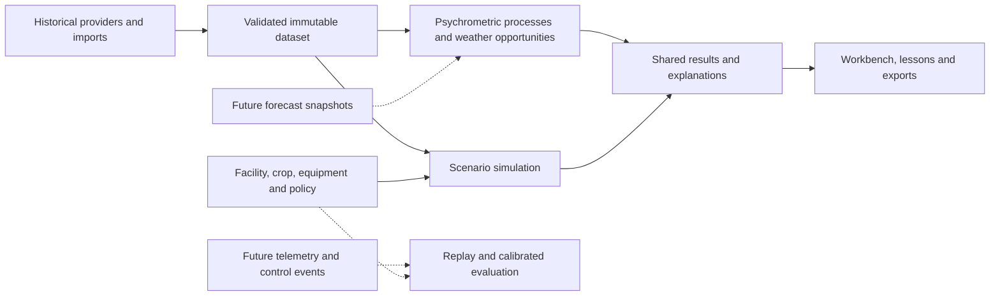

# Psychrometric Explorer: proposed standalone version and delivery plan

Date: 2026-09-22. Status: the recommended direction was endorsed in conversation ("good recommendation"); the detailed design below is proposed, and implementation has not started.

Basis: [fresh repository and landscape review](../../reviews/2026-09-22-repository-and-landscape-review.md), existing PRD/evaluation contracts, the academy reference, and the current user request. This proposal supersedes no existing document until accepted.

## Product intent

Build a reliable standalone tool that helps a grower understand what outdoor air can do, how greenhouse systems change heat and moisture, and why some conditions remain difficult. Every important result should answer: what happened, why, under which assumptions, and how much trust to place in it.

Working display name: **Grownetics Psychrometric Explorer**. Retain repository identity and licenses. Working audience is growers and students, with advanced technical detail available to engineers, consistent with the endorsed guided-workbench direction. No separate calculation engine is needed if the emphasis changes.

The requested longer-term direction is understood as two extensions:

1. Simple current/forecast weather guidance using the greenhouse's known equipment, without tuning or operating its control system.
2. Retrospective Grownetics analysis connecting changing targets, curtain/actuator states and measured climate, eventually supporting validated comparisons of control strategies.

Neither extension is part of the initial build. Their data boundaries are considered now so they do not require undoing the foundation.

## Approaches considered

| Approach | Advantage | Cost or limitation |
|---|---|---|
| **Recommended: a new guided workbench sharing a verified core** | Preserves physical accounting and regression coverage; permits a clearer educational experience; keeps static hosting | Requires careful extraction and explicit migration/compatibility checks |
| Incremental cleanup of the existing screen only | Smallest short-term code change | Keeps a workflow that exposes a great many assumptions before the learner understands the question; does not itself resolve data identity or validation gaps |
| Replace the engine and UI with a GreenLight-backed service now | Better starting point for detailed greenhouse dynamics and later calibration | Adds a runtime/service and parameterization burden before the simpler tool is trustworthy; does not automatically validate site predictions |

Use GreenLight initially as an offline benchmark candidate. Retain native ES modules, static hosting, workers and the existing test runner. A framework rewrite is not a prerequisite for reliability or education.

## Initial scope

Provide three connected workspaces:

### Understand an air state

Enter dry-bulb temperature, RH or dew point, and pressure/elevation basis. Show humidity ratio, dew point, wet bulb, enthalpy and air VPD. Provide metric/imperial input and display, with SI canonical values. Temperature differences and absolute temperatures have separate conversion rules.

Show a genuine psychrometric chart: dry-bulb horizontal, humidity ratio vertical, saturation/RH curves, selected states, and process paths. Display chart pressure. For a time series with varying pressures, the backdrop has a declared reference pressure and the selected-hour inspector uses the actual pressure; do not imply one backdrop exactly represents every hour.

Teach sensible heating, sensible cooling, moisture removal/addition, mixing and approximate evaporative cooling. Explain what each changes and what stays constant. Any condenser reheat or cooling capacity comes from the modeled equipment, not a decorative arrow.

### Explore historical operating windows

Choose a named teaching example, import weather, or retrieve a selected provider's historical record. Review location, data kind, dates, timezone, completeness, pressure basis and solar coverage before analysis. A teaching example is visibly a demonstration, never silently the user's facility.

Configure day/night targets and the systems present. Weather opportunity analysis works without a fully specified building. Do not require solar or equipment costs for a question that needs only the outdoor thermodynamic state.

Show operating opportunities by season and time of day, independent cooling/drying opportunities, consecutive difficult periods, and the selected hour's arithmetic. Count missing intervals explicitly. Separate weather feasibility, installed capability, and simulated dispatch.

### Compare declared greenhouse systems

Offer a baseline and explicit scenario changes on identical weather. Start with ventilation, pads, heating, shade/thermal curtains, refrigeration and dehumidification. Preserve existing advanced options through an advanced section, subject to their existing completeness requirements and new verification gates. Indoor and hybrid templates remain available; greenhouse learning is the default narrative.

Only ask for geometry, crop loads, lighting, capacities and prices when the selected calculation needs them. Mark values as measured, manufacturer-supplied, published assumption, or user assumption. A crop preset is editable and does not become a universal agronomic prescription.

Report joint temperature/VPD/dew-point attainment, excursion severity, longest failure episodes, equipment constraints, energy/water, and period cost where inputs support it. Keep DLI attainment separate from climate attainment. Distinguish whole hours from equivalent hours accumulated from substeps. Do not turn an assumed-performance comparison into a product recommendation.

## Educational interaction

Use the academy's question-led lab pattern, with these initial lessons:

| Question | Experiment | Explanation to retain |
|---|---|---|
| Can high-RH outside air dry a greenhouse? | Compare cold high-RH air with warmer indoor air | Compare humidity ratio, then include the heating tradeoff |
| Why does a pad help in dry weather and struggle in humid weather? | Change outdoor moisture and pad effectiveness | Wet-bulb limit and added moisture, with both target constraints |
| Why did RH fall when I heated the air? | Add sensible heat without moisture removal | RH changed; humidity ratio did not |
| Why can dehumidification increase cooling demand? | Enable a standalone condensing dehumidifier | Moisture removal, compressor power and heat destination |
| What does a curtain change? | Compare open/closed states with stated screen properties | Heat loss, daylight and moisture exchange tradeoffs; no surface-condensation prediction without a surface model |
| Why does the answer change across years or assumptions? | Change weather year or crop-moisture assumption | Sensitivity is not a statistical confidence interval |

For each lesson: ask the learner to predict, allow one change, show the physical effect, explain the result, and offer “Use this in my scenario.” Lessons and analysis call the same numerical functions. Display-rounded values never feed back into calculations.

The default explanation has three levels: one-sentence interpretation, substituted arithmetic, and equations/sources/full assumptions. Warnings appear where they change the decision, with a complete appendix available. Use keyboard-operable controls, text/table chart alternatives, non-color status distinctions, and responsive layouts. Preserve existing Grownetics assets and theme tokens; academy integration should not require a second set of physics or terminology.

## Architecture and contracts

Keep calculation modules independent of the DOM, provider I/O, credentials and presentation. Explanations are derived from result facts. If language-model assistance is added later, it narrates validated facts and labels uncertainty; it does not supply untraceable numerical results or silently choose actuator commands.

Proposed file boundaries, all relative to the repository:

| Area | Files | Responsibility |
|---|---|---|
| New standalone surface | `lab/index.html`, `lab/styles.css`, `src/workbench/app.js`, `src/workbench/state.js` | Guided navigation, draft/run lifecycle, advanced views |
| Psychrometric domain | `src/domain/psychrometrics.js`, `src/domain/processes.js`, `src/domain/opportunities.js` | Phase-aware state conversion, physical transformations, explicit weather decisions |
| Weather contracts | `src/data/weather-contract.js`, `src/data/weather-request.js`, `src/data/providers/` | Normalize once, provider/time/unit semantics, shared acquisition requests |
| Dataset repository | `src/data/dataset-store.js` | Immutable snapshots plus request index; migration from existing IndexedDB |
| Teaching/results | `src/education/lessons.js`, `src/education/explanations.js`, `src/workbench/psychrometric-chart.js` | Shared facts, lesson metadata, accessible plotting |
| Simulation boundaries | `src/simulation/zone.js`, `src/simulation/policy.js`, `src/simulation/runner.js` | Extract existing integration/dispatch in small verified steps; retain equipment primitives |
| Public facades | existing `physics.js`, `weather.js`, `simulate.js` | Preserve existing callers while delegating to the extracted modules |
| Evidence | `test/reference/`, `test/contracts/`, `docs/validation/` | Source-backed reference vectors, boundary tests, numerical/benchmark reports |

These paths define ownership, not a requirement to create every file at once. Move one responsibility only when its slice is implemented and verified. Do not keep two independently evolving solvers.

Dataset schema 2 should include `id`, `schemaVersion`, provider/product/model, coordinates/elevation/station, reporting timezone, `dataKind`, variable units/quality/provenance, UTC interval start/end, aggregation semantics, retrieval time, raw hash and transformation history. Forecast issue/run time is nullable and separate from retrieval time. Historical datasets need no invented forecast values.

For the first release, retain the hourly weather adapter boundary. Design interval records with explicit duration so a future telemetry importer can preserve native cadence without rounding events to hours. Migrate schema-1 weather without claiming information the old record never captured.

Run records include scenario/dataset hashes, engine/library versions, solver settings, initialization policy, evidence status, validity populations and warnings. Changing inputs marks a completed run stale; it cannot silently alter a displayed result. Only the active run may publish output.

## Accuracy and stability requirements

1. **Reference thermodynamics.** Validate known compatible reference states independently of implementation wrappers. Adopt the existing proposed tolerances: 0.05 K for dew/wet bulb, 0.00001 kg/kg for humidity ratio, and 100 J/kg for enthalpy, adjusted only for documented reference rounding. Include subzero phase conventions, altitude, near saturation and dry air.
2. **Physical accounting.** Preserve current conservation/capacity tests and add a regression for each confirmed numerical/data defect. Define the energy boundary explicitly; a small residual in a reduced model is not evidence of complete greenhouse physics.
3. **Provider contracts.** Test source classification, pressure basis, solar interval energy, units, DST, leap days, fractional timezone offsets, duplicates, gaps and key redaction. Use deterministic provider fixtures in CI; live checks are separate diagnostics.
4. **Numerical convergence.** Re-run current topologies on cold, hot-dry, hot-humid, high-solar and target-transition cases at 1, 0.5 and 0.25 minute dispatch. Proposed acceptance targets: energy change below 1%, attainment below 0.5 percentage points and maximum temperature difference below 0.2 K. A failed case limits the supported domain or remains experimental; an old cadence result is not a waiver.
5. **Initialization.** Compare plausible initial states and pre-roll lengths on slow and fast thermal-response cases. Add preceding weather when available. Report early transient sensitivity when there is insufficient history. Do not assume a fixed one-hour exclusion is sufficient.
6. **Independent evidence.** Assemble a pinned GreenLight comparison with matched boundaries, then measured cases for their supported crop/equipment/climate. Publish errors and mismatches. Initial release may provide verified thermodynamics and explicitly conditional equipment screening; it cannot claim site-predictive accuracy without held-out measurements.
7. **App resilience.** Exercise cancel/restart, stale responses, unavailable storage, malformed imports, offline use of saved examples, provider timeout, rate-limit response, and recoverable errors. Add explicit import size/interval-count budgets and reduce copies or stream records where practical.
8. **Release acceptance.** Compare app, CSV and report totals on identical populations; verify unit round trips, keyboard navigation, readable charts, mobile layout, relative asset paths and a subpath deployment. Source/data/engine versions accompany published examples.

Suggested product performance targets, to measure on a declared reference laptop: interactive single-state updates within 100 ms; cancel feedback within 250 ms; progress visible within 500 ms. These are proposed acceptance goals, not current measured performance.

## Delivery plan for the standalone version

Each phase ends in a reviewable working slice. Keep the current application available while the new `lab/` surface is being built. Use the repo's tests and static server; no production publishing is part of this plan execution by default.

### Phase 1: repair and freeze the data/physics foundation

Files: `src/weather.js`, `src/storage.js`, `src/app.js`, `src/physics.js`, their extracted contract modules, `test/data.test.mjs`, `test/model.test.mjs`, `test/contracts/`, `docs/validation/`.

- [ ] Capture a small immutable, redistributable regression dataset set and source checksums; retain existing fixture provenance.
- [ ] Write failing regressions for R1–R4, including both weather acquisition entry points and a future-data rejection case.
- [ ] Repair provider-aware caching and shared request construction; migrate old cache entries without overwriting provenance.
- [ ] Centralize phase-aware moisture conversion; document dew/frost conventions and validate reference states.
- [ ] Preserve data kind and prevent forecast/statistical records from entering historical operating-hour totals.
- [ ] Resolve R5's opportunity-versus-installed-capability semantics and test classifier boundaries.
- [ ] Verify pressure and solar conventions for each provider; where a convention is unresolved, expose the limitation and withhold dependent precision claims.
- [ ] Run affected tests, then `npm test`; verify real UI retrieval/import/error paths without requiring paid calls in CI. Record the new evidence and reconcile stale documentation.

Exit: the old application remains usable, defects have regressions, and the foundation can produce traceable reference results. Model-changing fixes increment the engine version and invalidate affected study claims until regenerated.

### Phase 2: deliver the single-state learning workbench

Files: `lab/`, `src/workbench/`, `src/domain/`, `src/education/`, `test/reference/`.

- [ ] Create the new entry point with a state calculator, editable pressure basis, unit switching and input validation.
- [ ] Implement the psychrometric chart and a table using the same computed states.
- [ ] Add the first four lessons and worked arithmetic from the shared calculation core.
- [ ] Check physical process endpoints against reference tests, keyboard operation, resize behavior and unit round trips.
- [ ] Serve with `python3 -m http.server 8150 --bind 127.0.0.1`; inspect `/lab/` in the real browser.

Exit: a learner can explain moisture content versus RH, the wet-bulb cooling limit and dehumidifier heat without retrieving weather or configuring a whole facility.

### Phase 3: connect historical operating-hour analysis

Files: weather/provider modules, `src/workbench/state.js`, `src/metrics.js`, `src/charts.js` or focused new views, `src/worker.js`, `src/export.js`, data/analysis tests.

- [ ] Add example/import/retrieval onboarding and a data-quality summary before calculation.
- [ ] Run weather-only analysis independently from the full equipment simulation.
- [ ] Add seasonal/time-of-day views, difficult episodes and synchronized hour inspection.
- [ ] Keep one immutable result source for charts, explanations, tables and exports.
- [ ] Exercise incomplete years, DST transitions, gaps and changing providers; assert eligible-hour denominators and source identity.

Exit: historical questions can be answered and reproduced with no hidden facility or equipment assumptions.

### Phase 4: integrate the verified equipment comparison

Files: existing equipment primitives, simulation extraction modules, `src/config.js`, scenario views, `src/metrics.js`, conservation/screens/model tests, `docs/validation/`.

- [ ] Extract zone integration and control policy behind compatibility facades, preserving baseline behavior before changing fidelity.
- [ ] Add progressive facility/crop/equipment forms, explicit scenario differences and assumptions inspection.
- [ ] Add screen and uncertainty lessons using actual modeled comparisons.
- [ ] Run topology-specific convergence and initialization studies; resolve failures or restrict supported configurations explicitly.
- [ ] Show matched-period attainment, severity, energy/water and conditional economics. Keep advanced topologies marked by their actual evidence status.
- [ ] Regenerate only the studies whose model/data assumptions remain supportable, with pinned inputs and new engine identity.

Exit: users can distinguish the climate's opportunity from the modeled facility's response and identify the binding equipment or moisture constraint.

### Phase 5: benchmark, harden and package

Files: `docs/validation/`, test/reference fixtures, worker/storage/error boundaries, static-host assembly, README/workflow docs.

- [ ] Prepare the offline matched benchmark; report model-to-model agreement separately from measured-data error.
- [ ] Test cancellation, stale results, timeout/retry limits, storage denial, large/malformed imports and interrupted requests.
- [ ] Exercise the full learn → analyze → compare → export workflow, including a clean browser profile and saved-state restoration.
- [ ] Verify static serving under a subpath, accessibility and responsive layout; package a bounded offline teaching example.
- [ ] Publish a release evidence matrix distinguishing reference-verified psychrometrics, numerically checked screening and any separately benchmarked domains.

Exit: the standalone version is reviewable and reproducible. The accuracy language is bounded by completed evidence. Replacing the legacy entry point or publishing it is a later integration decision.

## Future extension A: weather-based preparation guidance

This can precede a calibrated digital twin. It uses a declared greenhouse/system profile plus current conditions or forecast snapshots to explain likely constraints and preparation needs.

Examples of the intended level, not current forecast advice:

- “The coming afternoon has little evaporative cooling headroom. Check that the installed pad/water system is ready and monitor indoor temperature.”
- “Outside moisture is forecast above your target ceiling overnight. Ventilation alone may offer limited drying; monitor humidity and confirm the installed moisture-removal system is available.”
- “A colder period increases the modeled heating burden. Review heating readiness and watch the indoor temperature and dew-point trend.”

No exact vent percentage, curtain schedule, setpoint change, actuator command or automated control is produced in this first advisory extension. Curtain observations may explain a tradeoff, but there is no proposed curtain-control sequence.

Each advisory records its time window, triggering physical condition, relevant installed systems, evidence, assumptions, confidence basis, and expiry. If indoor conditions are absent, state that the comparison uses the configured target rather than the actual greenhouse. Air dew point alone cannot establish leaf/screen wetness; surface temperature or an explicit surface model is needed.

Store `issuedAt`/provider run identity when available, `retrievedAt`, valid intervals, lead time, source type, and forecast revision. Keep observations, operational forecasts and statistical outlooks separate. Begin with a short operational horizon such as 24–72 hours; longer horizons have separately justified confidence. Do not invent confidence percentages or treat model spread as calibrated probability.

Backtest with the forecast available at the time, not weather observed afterward. Visual Crossing offers a historical-forecast endpoint with separate access requirements; alternatively record snapshots prospectively. Evaluate missed events, false alerts, useful lead time and lead-time-dependent weather errors. This extension is rule/model based first; optional generated wording cannot invent a rule or evidence.

## Future extension B: Grownetics control-performance evaluation

Preserve three different streams: what the operator/controller requested, what the equipment actually did, and what the greenhouse measured. A changed setpoint is not proof that an actuator changed. A command is not proof of achieved airflow or curtain position.

Minimum data contracts to agree when this extension starts:

| Stream | Required interpretation |
|---|---|
| Indoor/outdoor measurements | UTC sample/interval times, native cadence, units, sensor/zone identity, quality/calibration and missingness; T/RH minimum, pressure basis explicit |
| Target events | Effective time, variable, target/band, zone, old/new value where available, control mode and override state |
| Curtain/equipment commands | Device identity, command time/value, opening versus closure convention, units and mode |
| Realized actuator states | Feedback time/value, state quality, limits/faults; missing feedback remains unknown |
| Facility/crop context | Envelope, equipment maps/capacity, screen type and properties, crop stage/LAI or moisture-load evidence, relevant irrigation/lighting |
| Resource measurements | Metered electricity/fuel/water/condensate and boundaries, if savings or moisture-removal effectiveness is being evaluated |

Honor event effective times with a documented last-known-value rule and maximum validity. Do not interpolate a setpoint transition or carry a stale sensor through a gap. Different zones and duplicate sensors require an explicit mapping. Preserve native timestamps; analysis can resample afterward without losing events.

The first deliverable is descriptive replay: targets versus measured T/VPD/humidity ratio, curtain state, overshoot, settling behavior, excursions and actuator cycling. Label response metrics inconclusive when weather, lighting, irrigation or another simultaneous action confounds attribution. Temperature/RH/setpoints alone can show tracking behavior; they cannot uniquely identify equipment efficiency or the best alternative policy.

Then calibrate identifiable physical parameters, hold out contiguous periods and weather regimes, and compare forecast errors to simple baselines. Do not use later measurements or revised forecasts in earlier decisions. Separate calibration data from evaluation data.

Only after that, compare understandable candidate strategies such as deadband/dwell changes, staged coordination, or forecast-aware supervisory policies in counterfactual simulation. Compare safety/crop constraints, joint attainment, excursions, energy and switching on the same forcing; report model dependence and uncertainty. A modeled improvement is not causal proof from an uncontrolled before/after log. Field confirmation requires a separately designed trial or suitable quasi-experimental evidence.

This architecture leaves room for GreenLight, another identified model, or a calibrated reduced-order engine without changing the historical weather explorer. Automatic control remains a separate project with its own requirements.

## Academy integration later

Keep assets relative, hash/deep-link routes stable, teaching metadata separate from rendering, and host branding configurable. A first integration can be a linked standalone lab; later the academy can embed or mount the same workbench. No assumption is made about the academy's framework. Avoid shared global CSS/state and do not put private datasets or keys into lesson URLs.

## Decisions and remaining information

This proposal assumes a guided grower/student entry with advanced details, browser-local processing, and continued access to existing scenarios. It does not require a Grownetics export to build the initial tool. Before the telemetry extension, obtain a representative de-identified export and its field/event definitions. Before any site-specific performance claim, identify suitable measured validation data.

Review order: confirm this product boundary, then turn Phase 1 into a commit-sized implementation plan with exact regression fixtures and commands. Subsequent phases receive detailed execution plans against the verified contracts. No application implementation, forecast-advisory feature, telemetry integration or deployment was performed during this planning review.
